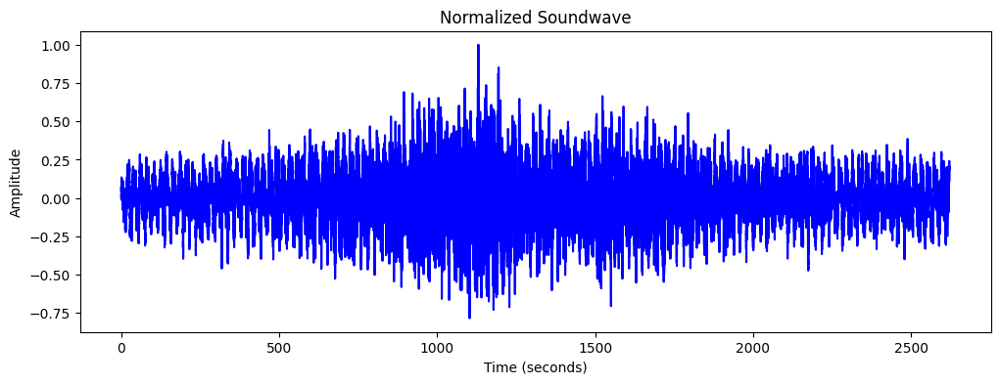
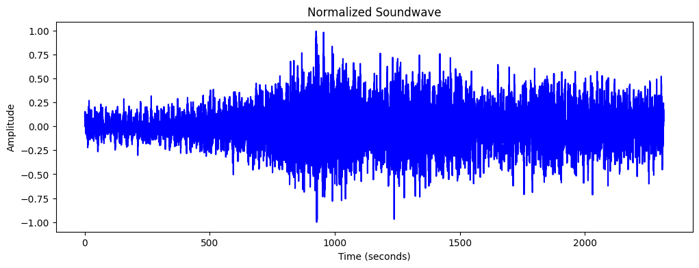
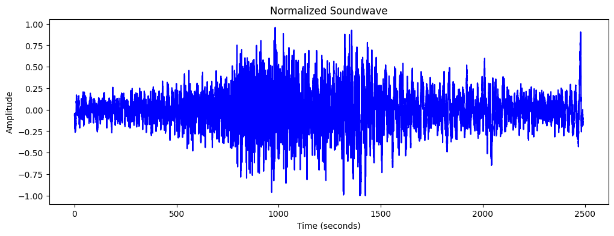

  

<h3 align="center">Audio Classification Model for Vehicle Identification</h3>

<!--  -->

---

<link rel="preconnect" href="https://fonts.gstatic.com">
<link href="https://fonts.googleapis.com/css2?family=Shadows+Into+Light&display=swap" rel="stylesheet">

"Revving up with data, our project deciphers the symphony of streets, distinguishing between cars and trucks one soundwave at a time."

## 📝 Table of Contents

- [About](#about)
- [Requirements](#requirements)
- [Dataset](#dataset)
- [Usage](#usage)
- [Audio Visualization](#audio-visualization)
- [Building the Machine Learning Model](#building-the-machine-learning-model)
- [Model Architecture](#model-architecture)
  - [SVM (Support Vector Machines)](#svm-support-vector-machines)
  - [Keras Sequential Models](#keras-sequential-models)
- [Use Case](#use-case)
- [Authors](#authors)
- [Acknowledgements](#acknowledgements)
- [References](#references)

## 🧐 About 

The aim of this project is to develop an advanced model for classifying vehicle types using audio files as input data. The model's primary objective is to accurately predict whether a given audio recording represents the sound of a car or a truck. Leveraging state-of-the-art machine learning techniques, the model will analyze the audio features extracted from the files to make these predictions.

## Requirements <a name = "requirements">

- **Python 3.6+**
- **NumPy (`pip install numpy`)**
- **Pandas (`pip install pandas`)**
- **Scikit-learn (`pip install scikit-learn`)**
- **SciPy (`pip install scipy`)**
- **librosa (`pip install librosa`)**
- **MatplotLib (`pip install matplotlib`)**
- **Seaborn (`pip install seaborn`)**
- **WTForms (`pip install wtforms`)**
- **Tensorflow (`pip install tensorflow>=1.15`)**
- **Keras (`pip install keras`)**
- **SVC (`pip install svm`)**

## Dataset <a name = "dataset">

### Dataset Description

The dataset comprises a collection of audio recordings capturing various vehicle sounds, accompanied by corresponding metadata stored in JSON format. Each entry in the dataset includes details such as the camera identifier (cam), classification probability (probs), class label indicating whether the sound belongs to a car or a truck (cls), timestamp (dto), and additional attributes.

### Metadata Attributes:

Camera Identifier (cam): Indicates the camera source of the audio recording.

Classification Probability (probs): Represents the probability of the classification result.

Class Label (cls): Specifies whether the sound corresponds to a car (class 2) or a truck (class 7).

Timestamp (dto): Denotes the date and time of the audio recording.

Other Fields: Additional attributes include intersection coordinates (intersection), bounding box coordinates (box), frame timestamp (frame_dto), sequence length (seq_len), and file paths for full and debug images.

Audio Files
The dataset includes audio files corresponding to each entry, stored in the specified paths under the snd field. These audio files capture the auditory signatures of vehicles, enabling the classification model to learn and distinguish between car and truck sounds.

## Usage <a name="usage">

### Training and Evaluation:

The dataset serves as a valuable resource for training and evaluating machine learning models for vehicle classification based on audio data.

### Research and Development:

Researchers and developers can leverage the dataset to explore novel approaches for vehicle sound analysis and classification.

### Real-world Applications:

The insights gained from this dataset can contribute to various applications, including traffic monitoring, urban planning, and surveillance systems.

## Audio Visualization <a name="audio-visualization">

To gain insights into the characteristics of our audio data, we have implemented a function called `plot_soundwave` using librosa library and Mel-frequency cepstrum to extract features. This function allows us to visualize the sound wave of an audio file.

By plotting the normalized sound wave, we can observe the amplitude variations over time. This visualization helps us understand the structure and patterns present in the audio data, which is crucial for feature extraction and model training.

Below is an example soundwave plot generated using the `plot_soundwave` function:

In this plot, the x-axis represents time in seconds, while the y-axis represents the amplitude of the audio signal. The peaks and troughs in the waveform indicate changes in the audio signal's intensity, providing valuable insights into the audio's structure and dynamics.

## Building the Machine Learning Model <a name="building-the-machine-learning-model">

We're developing a machine learning model to classify vehicle types from audio recordings, aiming to distinguish between cars and trucks. Starting with a dataset containing audio files and associated metadata, we extract relevant features using the librosa library. These features, including spectral and temporal characteristics, serve as inputs to our model. Through experimentation with algorithms like Support Vector Machines (SVM) and Convolutional Neural Networks (CNN), we aim to find the best architecture for accurate classification. After training and evaluation, the model will be deployed for real-world applications, enhancing tasks like traffic monitoring and urban planning.

## Model Architecture: 

For this project, two different machine learning architectures were employed: Support Vector Machines (SVM) and Keras Sequential models. Both approaches were utilized to train and evaluate the dataset for vehicle classification based on audio features.

### SVM (Support Vector Machines): 

Support Vector Machines are powerful supervised learning algorithms used for classification tasks. In this project, SVM was employed due to its ability to handle high-dimensional data effectively. SVM works by finding the hyperplane that best separates the data into different classes while maximizing the margin between the classes.

#### Feature Extraction:

Relevant audio features were extracted from the dataset to represent the characteristics of car and truck sounds.
Certainly! You can represent the shapes of your data in a table format like this in your README:

| Data    | Shape           |
| ------- | --------------- |
| X_train | (2479, 13, 100) |
| X_test  | (620, 13, 100)  |
| y_train | (2479,)         |
| y_test  | (620,)          |

This table provides a clear overview of the dimensions of the training and testing data.

#### Model Training:

The SVM classifier was trained using the extracted audio features to learn the decision boundary between car and truck classes.

SVC(kernel='linear')

#### Model Evaluation:

The performance of the SVM model was evaluated using metrics such as accuracy, precision, recall, and F1-score to assess its effectiveness in classifying vehicle types.

|              | Precision   | Recall   | F1-Score   | Support   |
| ------------ | ----------- | -------- | ---------- | --------- |
| Class 2      | 0.77        | 0.78     | 0.77       | 455       |
| Class 7      | 0.37        | 0.37     | 0.37       | 165       |
| ------------ | ----------- | -------- | ---------- | --------- |
| Accuracy     |             |          | 0.67       | 620       |
| Macro Avg    | 0.57        | 0.57     | 0.57       | 620       |
| Weighted Avg | 0.67        | 0.67     | 0.67       | 620       |

### Keras Sequential Models: <a name="keras-sequential-models">

Keras Sequential models offer a flexible and intuitive way to build neural network architectures. In this project, Sequential models were utilized to explore deep learning-based approaches for vehicle classification from audio data.

#### Feature Learning:

The Sequential model was designed to learn hierarchical representations of audio features through multiple layers of neural networks.

| Layer (type) | Output Shape | Param # |
| ------------ | ------------ | ------- |
| Flatten      | (None, 1300) | 0       |
| Dense        | (None, 256)  | 333,056 |
| Dropout      | (None, 256)  | 0       |
| Dense        | (None, 2)    | 514     |

Total params: 333,570 (1.27 MB)
Trainable params: 333,570 (1.27 MB)
Non-trainable params: 0 (0.00 B)

#### Model Training:

The Sequential model was trained on the dataset using optimization techniques such as gradient descent to minimize classification errors.

| Epoch | Training Accuracy | Training Loss | Validation Accuracy | Validation Loss |
| ----- | ----------------- | ------------- | ------------------- | --------------- |
| 1     | 0.6428            | 1.1014        | 0.6935              | 0.6833          |
| 2     | 0.7284            | 0.5854        | 0.6855              | 0.5987          |
| 3     | 0.6969            | 0.5946        | 0.6935              | 0.5902          |
| 4     | 0.7207            | 0.5595        | 0.7117              | 0.5709          |
| 5     | 0.7373            | 0.5453        | 0.7016              | 0.5739          |
| 6     | 0.7405            | 0.5355        | 0.7177              | 0.5698          |
| 7     | 0.7381            | 0.5539        | 0.6996              | 0.5709          |
| 8     | 0.7377            | 0.5415        | 0.7117              | 0.5760          |
| 9     | 0.7330            | 0.5379        | 0.7016              | 0.5818          |
| 10    | 0.7240            | 0.5452        | 0.7177              | 0.5601          |

#### Model Evaluation:

Similar to SVM, the performance of the Sequential model was evaluated using standard classification metrics to measure its accuracy and generalization ability.

| Metric        | Value   |
| ------------- | ------- |
| Test Loss     | 15.9903 |
| Test Accuracy | 0.7574  |

By employing both SVM and Keras Sequential models, this project aims to compare the effectiveness of traditional machine learning approaches with deep learning techniques for vehicle classification based on audio features. This hybrid approach allows for a comprehensive evaluation of model performance and provides insights into the most suitable methods for this specific task.

## Use Case:

The trained model can be deployed for practical applications requiring real-time vehicle classification. Users can input audio samples into the model, and it will output predictions indicating whether the sound corresponds to a car or a truck.

## ✍️ Authors 

- [@bprakashputta](https://github.com/bprakashputta) - BHANU PRAKASH PUTTA
- [@meghanakanduls](https://github.com/meghanakanduls) - SAI MEGHANA KANDULA

See also the list of [contributors](https://github.com/kylelobo/The-Documentation-Compendium/contributors) who participated in this project.

## 🎉 Acknowledgements 

- Professor Tyler Conlon
- Professor Sumona Mondal
- Professor Boris Jukic

## References 

- [Audio Analysis](https://www.altexsoft.com/blog/audio-analysis/)
- [Voice Activity Detection](https://mohitmayank.com/a_lazy_data_science_guide/audio_intelligence/voice_activity_detection/)
- [Audio Deep Learning Made Simple](https://towardsdatascience.com/audio-deep-learning-made-simple-sound-classification-step-by-step-cebc936bbe5)
- [Classification of Vehicles Based on Audio Signals using Quadratic Discriminant Analysis and High Energy Feature Vector](https://www.researchgate.net/publication/273898873_Classification_of_Vehicles_Based_on_Audio_Signals_using_Quadratic_Discriminant_Analysis_and_High_Energy_Feature_Vectors)
- [OpenAI. (2024). ChatGPT (3.5) Large language model](https://chat.openai.com)
